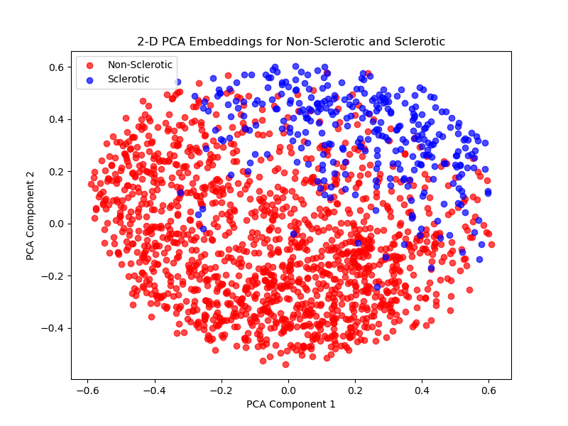
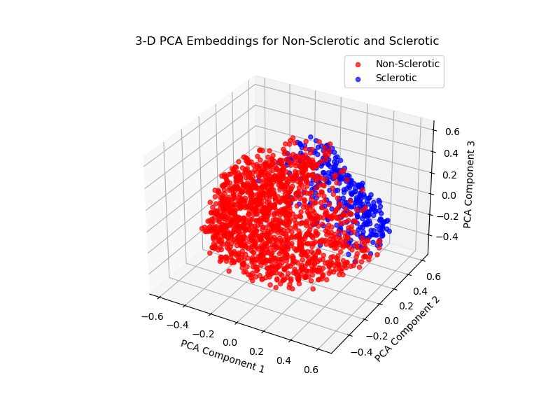
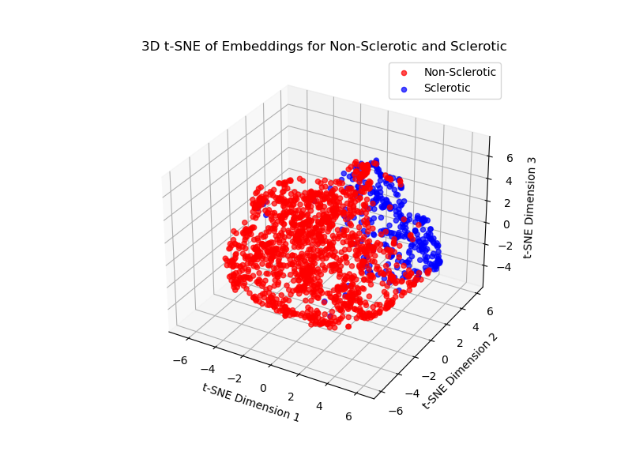
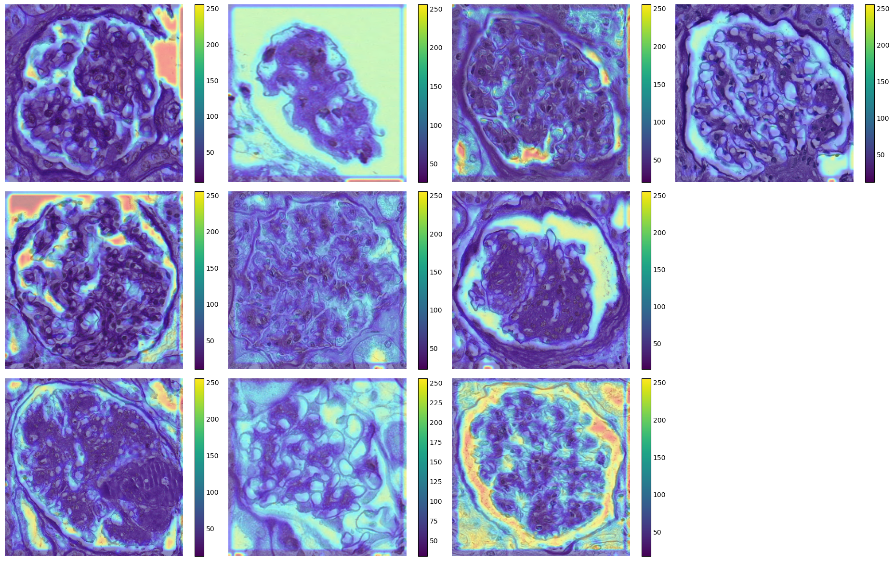
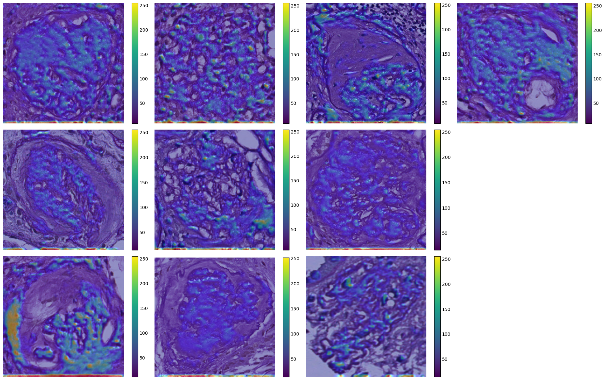

## Literature Review
Whenever I am given data from any domain, be it health science, plant science, finance, etc, I try my best to first gain a foundational understanding of the problem from a domain-specific perspective. In this case, I started by studying literature related to glomeruli to understand what happens in sclerotic and non-sclerotic. My goal was to understand the biological significance of the problem and explore how machine learning has been applied in similar tasks. I reviewed papers that solved similar classification problems, which helped me understand the previous methodologies used and the results that could be expected. Having experience across different domains of life science such as health science and plant science, I understand that expectations for results and approaches vary across fields.

One paper I found by Pesce et al. [1], discussed the implementation of machine learning to classify sclerotic and non-sclerotic glomeruli. This paper introduced two approaches: traditional feature extraction and deep learning. In the feature extraction approach, I learned about using morphological and textural features for classification. Morphological features such as measurements of Bowman's capsule and glomerular diameters, and textural features such as LBP and Haralick texture descriptors were discussed. I was previously unfamiliar with these specific features, so I did some research on how they are defined and calculated. Based on my reading, I understood that morphological features are crucial because sclerosis alters the structure of the glomeruli. Hence, quantitative metrics like changes in area, width, or shape could help identify sclerotic glomeruli. On the other hand, textural features may depend on the image collection process. The second approach mentioned in the paper was deep learning-based. The machine learning model based on hand-crafted features seemed more explainable, however I realized that I would need detailed information about the images, such as how they were collected and acceptable parameter ranges which would require help from medical experts. Therefore, I decided to focus on automatic feature extraction using deep learning models.

Since morphological features are important, I read another paper by Tsutsumi et al. [2], which used variational autoencoders (VAE) for automatic morphological feature extraction. It showed promise for extracting relevant features across several classes. These two papers laid the foundation for my approach, and I decided to use deep learning for automatic feature extraction rather than relying on manual feature extraction, which could introduce errors/bias without medical expertise.

## Materials and Methods

I read a few more papers in the medical field that implemented recent and advanced DL approaches. For example, a paper by Dimitri et al. [3] utilized the DeepLab V2 model to segment sclerotic and non-sclerotic glomeruli from scanned Whole Slide Images (WSIs). I was specifically interested in applying a self-supervised modeling approach because I used this appoach to solve one of my master's thesis projects which was one of the toughest problems I had encountered. My previous experience played a role here as I believed that using self-supervised learning could help extract features that we humans may not easily see. As we all know, the famous AI scientist Yann LeCun named self-supervised learning as the 'dark matter of intelligence' (LeCun and Misra [4]). A paper by Nielsen et al. [5] discussed the implementation of self-supervised learning even with small training samples as low as 100. We had an imbalanced dataset with 1,054 sclerotic images and 4,704 non-sclerotic images. I decided to include self-supervised learning as one of the models for this problem because I expected it to perform well.

I also decided to implement the VAE approach by Tsutsumi et al. [2] to see if morphological features extracted using this method could help differentiate the two classes. Apart from these two advanced models, one based on self-supervised learning and the other on VAE, I included a third simpler model VGG-16. VGG-16 is a well-known model that is widely used across different fields and has been very popular for image classification tasks.

###
**a) Self-supervised Learning:** Training self-supervised learning requires two phases. The first phase involves training on unlabeled images, which acts like 'unsupervised learning' where the model learns the features of the images from the unlabeled dataset. After this phase, the model weights are saved. These saved weights act as a feature extractor. In the second phase, a small labeled dataset is passed through this saved model to extract features. Since we now know the features of the labeled classes, these labeled features are passed through another machine learning model to make predictions, which is the second phase of training.

I wrote a python program to take 70% of the images from each class and put them into an unlabeled folder named 'images' https://www.dropbox.com/scl/fo/mo12wsuzs8rkmyjl17z9m/AAXdQowRocn1kDHTqH0QYjI?rlkey=sx9bw6rfu5knhlx2rojrfwso9&st=u3psqgkz&dl=0, which contains both classes but acts as unlabeled data. The remaining 30% of the images were labeled and kept in two separate folders corresponding to their respective classes. I used the lightly Python framework https://docs.lightly.ai/self-supervised-learning/lightly.html, which is popular for self-supervised learning, and trained the SimCLR architecture on 4,029 images for 50 epochs in the first phase. The trained model was saved as simclr_model.ckpt, which is available at https://www.dropbox.com/scl/fi/izp38wwto6xdx3ykpizhu/simclr_model.ckpt?rlkey=g76ep923pvw84e8fh2pkxpz73&st=wbjks0xf&dl=0  This saved model extracts 512-dimensional features (embeddings). This trained model's weight was then used to extract features from the labeled images of 317 sclerotic and 1,042 non-sclerotic glomeruli. These images can be found here: https://www.dropbox.com/scl/fo/rxctbnx27l8t9q669nigu/AOG0_kUsJgqzAF2oizzHyz0?rlkey=455wjotgqxzzggj1zgkdhazaa&st=wiopignx&dl=0. Since the extracted features are in 512 dimensions, many dimensions may be unnecessary and could introduce noise. To handle this, I applied PCA to reduce the dimensionality to 150. The embeddings for both sclerotic and non-sclerotic (512-dimensional features) have been saved as NumPy arrays at **"simclr_embeddings"**, which can be used in the future to try different methods for the second phase of training on this small sample if needed. After reducing the features to 150 dimensions, the embeddings for sclerotic and non-sclerotic samples were merged, and four supervised models: logistic regression, random forest, support vector machine, and a neural network were trained on these features using an 80% training and 20% testing split. Stratified sampling was used to ensure the class distribution was maintained. The reason a validation set was not used during the second phase of training is due to two key factors. First, the main purpose of this approach is to leverage as many images as possible from both classes during the first phase of training to ensure the model learns strong and meaningful features. In self-supervised learning, the success of the entire process heavily depends on how well the model extracts features during this first phase. Hence, in the second phase the focus was on optimizing the training based on these pre-learned features. Since the model had already learned a robust representation of the images in the first phase, using a validation set during the second phase was less crucial especially due to the smaller number of labeled images available. Therefore, the final model was directly evaluated on the test set to evaluate its performance.

The neural network model had the following architecture:

Input layer: (150,), Dense layer: 128 units with ReLU activation, Dropout layer: 30% dropout rate, Dense layer: 64 units with ReLU activation, Dropout layer: 30% dropout rate, Output layer: 2 units with softmax activation

All models were trained for 50 epochs. The entire training workflow for both phases can be found here:**"model_trainings/selfsupervised.ipynb"**. The final neural network model weights were saved here:https://www.dropbox.com/scl/fi/7p3ckeea2jzmdk2hpk0l7/simclr_neuralnetwork_model.h5?rlkey=zhs6202vphkj96m09cdv7su9m&st=ygf07hec&dl=0. 


**b) VAE:** This was the first model I tried for training, out of the three models implemented. I started by reviewing the paper by Tsutsumi et al. [2] to understand the model architecture used by the authors. I also explored the GitHub repository of the paper, specifically focusing on the functions used to train the model: https://github.com/masa10223/Morpho-VAE/blob/main/CODE/functions.py .  I reviewed the create_model function and the loss functions, but they needed adjustments to fit our dataset. I wrote and ran each line of the code to fully understand the workflow, making changes slowly based on the errors I encourntered in jupyter. Once I resolved all the issues, I converted the adjusted lines of code into functions. The final functions used in this process are available in the notebook  **"model_training_workflow/VAE.ipynb"**. This paper used convolutions on each channel of the image separately. I modified this by applying convolutions to the entire image at once, rather than processing each channel individually. I also broke down the loss function into three separate functions. Additionally, I included hyperparameter tuning to optimize the number of layers, filter counts, and activation functions. Hyperparameter tuning plays a critical role in obtaining the best model for optimal performance. 10 trials were initially planned for tuning. Before setting up the training, I wrote a script to process the public.csv file, which contained the ground truth labels for the images. I did quality check there were no NaN values in the CSV and verified that the number of instances matched the image counts in the two folders. The dataset was then split into training and testing sets (80/20) using stratified sampling. During hyperparameter tuning the training images were further split using 5-fold cross-validation to identify the best hyperparameters. A random seed was set to ensure reproducibility in both model training and dataset splitting. Once optimization began, I realized that first trial took approximately 6 hours, means 10 trials would take around 60 hours. After running the first trial, I decided to interrupt the process and used the best hyperparameters obtained from that first trial. I used Optuna a popular hyperparameter optimization framework https://optuna.org/ . 

MLOps is an important part of the machine learning lifecycle especially when it comes to production. I wanted to showcase my skills in MLOps as well. So once I had the optimal hyperparameters, I wrote another function for training the optimal model using MLFlow, an open-source framework https://mlflow.org/ to present how this tool can manage different stages of the ML lifecycle including deployment. In my case, I implemented only the basic functionalities of MLFlow, but more advanced versions could be used in the future for managing the ML lifecycle at different stages or for deployment purposes. After obtaining the optimal hyperparameters, I manually passed those values into this new function to further train the model. This second round of training used the entire training dataset without splitting it into train and validation sets, as we already had the best hyperparameters from a similar distribution. Increasing the dataset size can help improve the model's performance especially due to the imbalanced data. Once the second training phase was complete using the best hyperparameters, weights of the final model for deployment was saved here: https://www.dropbox.com/scl/fi/j16o4kymhajpazflri11w/best_deployed_vae_model.h5?rlkey=ngx8xoafivky2tr83lsc26nwp&st=ohu96459&dl=0 . This saved model was then evaluated on the test set. Throughout both training stages, 20 epochs were used for the first phase during optimization, and 50 epochs were used for the second phase to train the optimal model.

Model explainability is important for understanding how the model predicts classes. I used a popular technique called GradCAM to generate heatmaps on the images, which highlight the areas that play a significant role in distinguishing between classes. I wrote the GradCAM code, loaded the final deployed model weights, and used the weights just before the flattening layer to plot the gradients. I used 10 images from each class, where the predicted label matched the ground truth to get an overall idea of the activation patterns for each class. This approach provides a biological perspective that medical experts who may not be familiar with deep learning can understand. Model explainability is vital for all kinds of stakeholders, as it helps increase the reliability of the model during deployment especially in the medical field where patient lives are involved. The workflow for GradCAM is available in **"GradCAM.ipynb"**

**c) VGG-16:** VGG-16 is a popular supervised learning model for classification tasks. In this case, I used pre-trained model weights on the ImageNet dataset. The last layer of the model was removed, and the weights of all the previous layers were frozen, means they were set as untrainable. This allowed the pre-trained model to act as a feature extractor since it had already been trained on a large number of images.

After modifying the pre-trained model, the custom architecture was added for training on the custom dataset. To train the VGG-16 model on the custom dataset, I wrote Python code to split the dataset into training, validation and test set and the split was 80% for training, 10% for validation, and 10% for testing. Each of these sets contains two folders for the respective classes. The modified dataset for training, validation, and testing is available here: https://www.dropbox.com/scl/fo/p703rw9d0qf39nnc6r0ph/APrpq4QP9LZYn3k7i3LIOeo?rlkey=pmiz9tu47m6egslsqkhhstn7a&st=61ibqtqb&dl=0.  The model was trained for 50 epochs, and after each epoch the model was evaluated on the validation set. The final classification report was generated on the test set for performance evaluation. TensorFlow Keras was used for building and training the model. The entire workflow of training is available in the notebook: **"model_trainings/VGG.ipynb"** The weights of the final trained classification model are available here: https://www.dropbox.com/scl/fi/vgeyfztem46m72tsx7nyw/vgg16_model.h5?rlkey=ht9wbl7wceorf6bso7rmn7dk0&st=26p48651&dl=0

## Results and Discussions

###
**a) Self-supervised Learning:** The embeddings from the labeled images of 317 sclerotic and 1,042 non-sclerotic available at https://www.dropbox.com/scl/fo/rxctbnx27l8t9q669nigu/AOG0_kUsJgqzAF2oizzHyz0?rlkey=455wjotgqxzzggj1zgkdhazaa&st=wiopignx&dl=0 were reduced from 512 dimensions to 150 dimensions using PCA. The explained variance ratio was 0.9986841479224007 for sclerotic and 0.9975686822899207 for non-sclerotic. This high explained variance shows that even after reducing the dimensionality to nearly one-third of the original features, these 150 PCA components still captured most of the variance in the data. To investigate whether a separation between the two classes (sclerotic and non-sclerotic) could be observed visually, I performed PCA to reduce the data to 2 and 3 dimensions. I then plotted the embeddings using scatter plots for both cases. The 2-D PCA plot is shown below , where the embeddings from the labeled images of 317 sclerotic and 1,042 non-sclerotic are visualized in 2-D space . The cumulative explained variance for these two PCA components was 0.5230. It also shows that there is still a significant overlap between the sclerotic (blue) and non-sclerotic (red) classes, indicating that the first two components alone will not be sufficient for classification.  

The cumulative explained variance for the 3-D plot was found to be 0.71, means that these three components capture 71% of the variance in the data. The additional third component helps to better separate the classes, as shown in the plot, but some overlap still remains. This suggests that more higher dimensions are required for better class separation boundaries. 

I also applied 3-D t-SNE clustering to visualize the separation of these features as shown in the plot below: 

Looking at these plots, we can conclude that the self-supervised model trained on unlabeled images was able to extract useful features to separate the two classes. These visualizations can also be a form of model explainability showing how the embeddings separate the sclerotic and non-sclerotic. When the 150-dimensional embeddings were used to train four different supervised models, their performance evaluated on the test data are shown in the table below:

| Model                   | Class         | Precision | Recall | F1-Score | Accuracy |
|---------------------    |---------------|-----------|--------|----------|----------|
| Logistic regression     | Non-Sclerotic |   0.99    |  0.89  |   0.93   | 0.898    |
|                         | Sclerotic     |   0.65    |  0.95  |   0.77   |          |
| Support Vector Machine  | Non-Sclerotic |   0.98    |  0.89  |   0.93   | 0.896    |
|                         | Sclerotic     |   0.66    |  0.90  |   0.76   |          |
| Random Forest           | Non-Sclerotic |   0.91    |  0.98  |   0.95   | 0.907    |
|                         | Sclerotic     |   0.88    |  0.57  |   0.69   |          |
| Neural Network          | Non-Sclerotic |   0.99    |  0.94  |   0.96   |  0.942   |
|                         | Sclerotic     |   0.79    |  0.94  |   0.86   |          |

 Based on the performance results, we can conclude that both logistic regression and SVM performed well for the non-sclerotic class achieving high precision and recall. However, both models obtained poor precision for the sclerotic class. This indicates that these models may be useful for accurately classifying non-sclerotic, deploying them for diagnosing sclerotic cases could lead to incorrect treatment as patients with non-sclerotic will be incorrectly diagnosed. The results suggest that although these models can detect over 90% of sclerotic (high recall) they misclassify non-sclerotic as sclerotic. The random forest model also performed well for non-sclerotic, but using it for sclerotic could result in missing many sclerotic by misclassifying them as non-sclerotic. The neural network outperformed the other models in classifying sclerotic obtaining F1-score of 0.86 and high overall accuracy 0.942. This makes it the best model for deployment in scenarios where accurately distinguishing between sclerotic and non-sclerotic is critical. From a medical perspective the neural network is likely to be preferred in situations where the detection of all sclerotic cases is important. There is still room for improvement across all tehse models especially in handling the class imbalance which seems to affect the sclerotic classification. Future work could explore techniques such as more training samples for sclerotic or synthetic data generation to further improve performance. This approach does seem to show promise for utilizing self-supervised learning in cases where there is an imbalance or insufficient data.

**b) VAE:** After the first phase of training for optimizing the hyperparameters, optimal parameters obatined were 'num_layers': 3, 'filters_0': 39, 'filters_1': 105, 'filters_2': 21, 'activation_function': 'relu'. With these values, when optimal model was obtained and tested on test set, performance is listed below:

| Metric        | Non-Sclerotic | Sclerotic |  Test Accuracy   |
|---------------|---------------|-----------|------------------|
| Precision     | 0.84          | 0.69      | 0.83             |
| Recall        | 0.98          | 0.17      |                  |
| F1-Score      | 0.91          | 0.27      |                  |

The results indicate that the current version of the VAE model performed poorly with identifying sclerotic images as only 17% of sclerotic were correctly classified. This underperformance could be due to several factors, first phase of training was stopped after the first trial during the optimization process which may not have allowed the model to fully converge. Data augmentation or adding more sclerotic samples could have improved the model's ability to generalize on the minority class.

GradCAM was then applied to visualize the important regions for 10 test images from each class, where the predicted label matched the ground truth. For non-sclerotic class, the visualization below shows which areas of the images contributed most to the model's predictions. 

Similarly, GradCAM for sclerotic is shown in the plot below. 

The regions with higher color intensity (moving from purple to yellow/red) indicate areas that the model finds important for its classification decisions. These regions likely contain key features that the model uses to distinguish between the two classes. These heatmaps provide insight into where the model is focusing, but these patterns alone may not be sufficient to fully understand the biological context without medical experts.

**c) VGG-16:** The performance of the VGG-16 model on the test set is in the table below:

| Metric        | Non-Sclerotic | Sclerotic |  Test Accuracy   |
|---------------|---------------|-----------|------------------|
| Precision     | 0.98          | 0.95      | 0.9723           |
| Recall        | 0.99          | 0.90      |                  |
| F1-Score      | 0.98          | 0.92      |                  |

Among the three models implemented, self-supervised, VAE, and VGG-16, VGG-16 model outperformed the others in terms of overall accuracy. It also gives a good balance between precision and recall for both non-sclerotic and sclerotic. This makes VGG-16 the most reliable model for deployment. In contrast, the other models showed limitations in specific scenarios. The self-supervised neural network have comparatively low precision (0.79) in the sclerotic class, misclassifying non-sclerotic as sclerotic which could lead to diagnosis of non-sclerotic patients. VGG-16 performed well for this task due to its use of pre-trained ImageNet weights on millions of images and these features work well to classify our two classes. VGG-16 model will be an efficient and reliable option for deployment especially in scenarios where simplicity and computational cost are important.

## Running the code

To run the code of this project, you have two options: cloning the repository using Git or downloading the repository as a ZIP file. Follow the steps below for either method:

### Option 1: Clone the Repository Using Git

1. Clone the repository to your local machine:
   ```bash
   git clone https://github.com/dhiraj-ms/CMIL.git

### Option 2: Download the Repository as ZIP
 1. Go to https://github.com/dhiraj-ms/CMIL in your web browser
 
 2. Click the green Code button.

 3. Select Download ZIP.
 
 4. Extract the ZIP file to a directory on your local machine.

### Running Training and Inference Notebooks
 1. First, open Anaconda Prompt and navigate to the project folder you cloned using the `cd` command: cd CMIL

 2. Then, run the following command to install the dependencies required for the project. The environment will be named cmil: conda env create -f environment.yml

 3. After the installation is complete, activate the environment: conda activate cmil

 4. Now, open Jupyter Lab in this environment: jupyter lab

 5.  Download Model Weights: Download all the model weights and folders from the link mentioned in the Materials and Methods and Results sections of the README. Store the downloaded files in the appropriate location within the project folder.

### Running Training Notebooks
1. The notebooks for model training are available in the model_training_workflow folder.

2. Open each notebook, and running cells will be self-explanatory.

3. Ensure that the dataset paths for each model training are correctly arranged. You will find the required paths specified within each notebook.

### Running Inference Notebooks

1. Inside the inference folder, you will find notebooks for running inference on test folder using the saved models.

2. If you want to run inference on just one folder of images using VAE_inference.ipynb, modify the image_processing function to remove the splitting part, and the rest should work fine.

3. The other two inference notebooks are used for running predictions on a single folder or the entire dataset.

## Running the Evaluation on a Folder of Images

- The best model among all three models, which is vgg16, is considered for deployment.
- Keep `vgg16_model.h5` in the same folder as the project in the cmil environment.
- Place the folder of images in the project folder.
- Run the following command:

   ```bash
   python evaluation.py "image_folder_name"

- The predicted output will be evaluation.csv in the directory.

## Project Approach and Reflection

My approach to this problem was to demonstrate the full range of my machine learning skills. I aimed to present a comprehensive understanding, covering supervised model training, self-supervised learning concepts, autoencoder use as a generative model, Grad-CAM for model explainability, and the incorporation of MLOps principles. My goal was to convey my excitement for machine learning by showcasing each aspect throughout the exercises. Given the time constraints, I may have missed a few elements, but I spent approximately 52 hours working on this project, from literature review, ideation, experimentation, to documentation (yes, I kept track, haha!). At my current position at the Danforth Center, I am a core development member of the PlantCV and PlantCV-Geospatial software projects, where I have gained experience working collaboratively on GitHub to develop packages. I applied the same principles to this assignment for documentation showcasing that I am familiar with the software package development process, even though a pull request and creating branch were not required in this case. I am genuinely excited to receive feedback on this assignment as it will be invaluable in helping me refine my work and grow professionally.

## References

1. Pesce F, Albanese F, Mallardi D, Rossini M, Pasculli G, Suavo-Bulzis P, Granata A, Brunetti A, Cascarano GD, Bevilacqua V, Gesualdo L. Identification of glomerulosclerosis using IBM Watson and shallow neural networks. J Nephrol. 2022 May;35(4):1235-1242. doi: 10.1007/s40620-021-01200-0. Epub 2022 Jan 18. PMID: 35041197; PMCID: PMC8765108.

2. Tsutsumi, M., Saito, N., Koyabu, D. et al. A deep learning approach for morphological feature extraction based on variational auto-encoder: an application to mandible shape. npj Syst Biol Appl 9, 30 (2023). https://doi.org/10.1038/s41540-023-00293-6

3. Dimitri, Giovanna & Andreini, Paolo & Bonechi, Simone & Bianchini, Monica & Mecocci, Alessandro & Scarselli, Franco & Zacchi, Alberto & Garosi, Guido & Marcuzzo, Thomas & Tripodi, Sergio. (2022). Deep Learning Approaches for the Segmentation of Glomeruli in Kidney Histopathological Images. Mathematics. 10. 1934. 10.3390/math10111934. 

4. LeCun Y, Misra, I. Self-supervised learning: The dark matter of intelligence. https://ai.meta.com/blog/self-supervised-learning-the-dark-matter-of-intelligence/ 

5. Nielsen, M.; Wenderoth, L.; Sentker, T.; Werner, R. Self-Supervision for Medical Image Classification: State-of-the-Art Performance with ~100 Labeled Training Samples per Class. Bioengineering 2023, 10, 895. https://doi.org/10.3390/bioengineering10080895